# End-to-End DevOps Pipeline on AWS EKS

A production-style CI/CD and GitOps pipeline: Terraform-provisioned AWS infrastructure, a Jenkins build pipeline with integrated security scanning, ArgoCD-driven GitOps deployment to Amazon EKS, and full-stack monitoring with Prometheus and Grafana.

Originally built on Minikube; rebuilt on real AWS EKS to demonstrate production infrastructure, IAM/cluster access patterns, and cloud-native GitOps workflows end to end.

**Live app:** http://ab784a2b4a2a04ca3803dcbeb2a6e7d0-1328853170.ap-south-1.elb.amazonaws.com
**Repo:** https://github.com/Jayesh0601/devops-pipeline-project

---

## Architecture

```
 Developer
     |  git push
     v
 GitHub Repo ----webhook----> Jenkins (AWS EC2)
                                    |
                                    |  8-stage pipeline:
                                    |  checkout -> install deps -> pytest ->
                                    |  SonarQube scan -> docker build ->
                                    |  Trivy scan -> push to DockerHub ->
                                    |  update k8s manifest in Git
                                    v
                               DockerHub
                                    ^
                                    | pulls image
                                    |
 GitHub Repo <---watches--- ArgoCD (running inside EKS) ---auto-syncs---> EKS Cluster
                                                                                |
                                                          +---------------------+---------------------+
                                                          |                                           |
                                                devops-app Deployment                        Prometheus + Grafana
                                                (2 replicas, LoadBalancer Svc)                 (metrics + alerting)
                                                          |
                                                          v
                                                     AWS ELB --> Internet --> User
```

**The core GitOps principle:** Jenkins never deploys directly to the cluster. It builds, tests, scans, and pushes an image, then commits the new image tag to Git. ArgoCD — running inside the cluster with its own scoped credentials — watches that repo and reconciles cluster state to match. Git is the single source of truth; `selfHeal: true` means any manual drift (e.g. a stray `kubectl edit`) gets automatically reverted back to match Git.

---

## Tech Stack

| Layer | Tools |
|---|---|
| Infrastructure as Code | Terraform |
| Cloud Platform | AWS (VPC, EC2, EKS, IAM, ELB) |
| CI | Jenkins |
| Containerization | Docker |
| Orchestration | Kubernetes (Amazon EKS v1.32) |
| CD / GitOps | ArgoCD |
| Code Quality | SonarQube |
| Security Scanning | Trivy |
| Monitoring | Prometheus, Grafana (via kube-prometheus-stack Helm chart) |
| App | Python Flask |

---

## Step-by-Step Build (with commands and screenshots)

### 1. Provision infrastructure with Terraform

VPC (public subnets, no NAT), a Jenkins EC2 instance, and an EKS cluster with 2 managed worker nodes.

```bash
cd eks-devops-project
terraform init
terraform plan
terraform apply
```

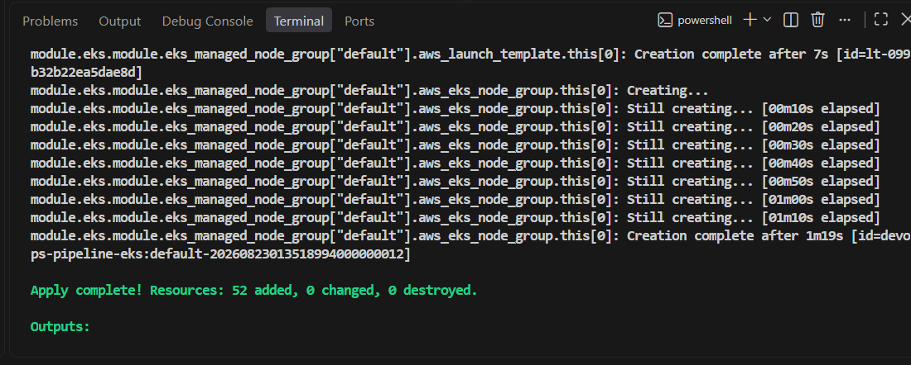
*52 resources provisioned — EKS node group creation confirmed.*

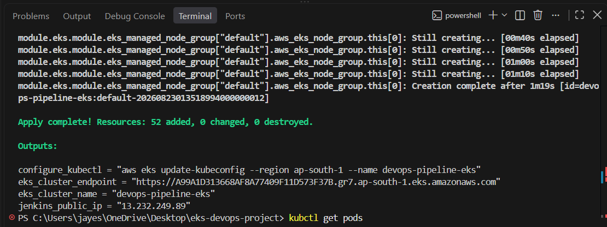
*Outputs: cluster endpoint, Jenkins public IP, and the kubeconfig command to run next.*

---

### 2. Configure kubectl and verify the cluster

```bash
aws eks update-kubeconfig --region ap-south-1 --name devops-pipeline-eks
kubectl get nodes
```

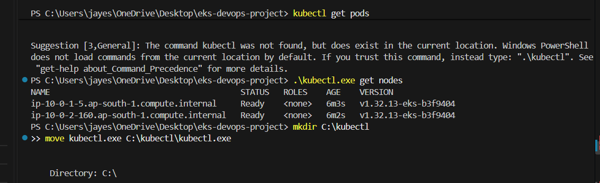
*2 EKS worker nodes, both Ready. (On Windows: had to move kubectl.exe to `C:\kubectl` and add it to PATH manually per terminal, since the permanent PATH via GUI kept failing.)*

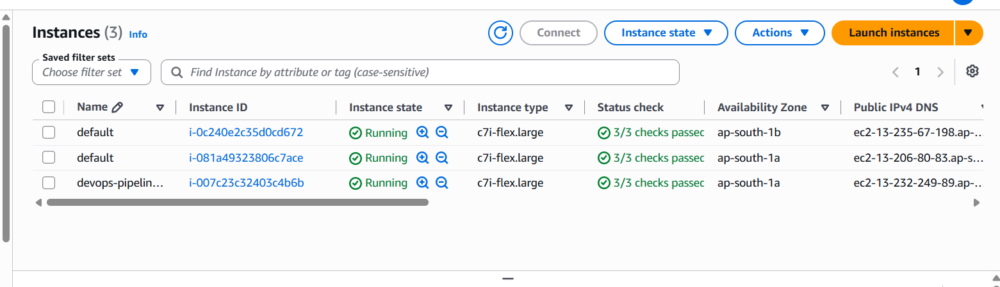
*3 running EC2 instances confirmed in the AWS Console — 2 EKS worker nodes + 1 Jenkins server.*

---

### 3. Install ArgoCD and deploy the Application

```bash
kubectl create namespace argocd
kubectl apply -n argocd -f https://raw.githubusercontent.com/argoproj/argo-cd/stable/manifests/install.yaml

kubectl apply -f argocd/application.yaml
kubectl get applications -n argocd
```

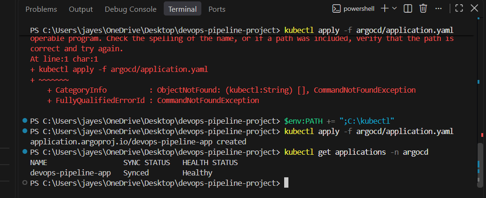
*Application applied via kubectl — Synced and Healthy on first check.*

`application.yaml` is unchanged from the original Minikube version — `destination.server: https://kubernetes.default.svc` is the in-cluster API DNS name, so it resolves correctly regardless of which cluster ArgoCD runs inside.

---

### 4. Kubernetes manifests

`k8s/deployment.yaml` and `k8s/service.yaml` define the app deployment (2 replicas) and a `LoadBalancer` Service that provisions a real AWS ELB automatically.

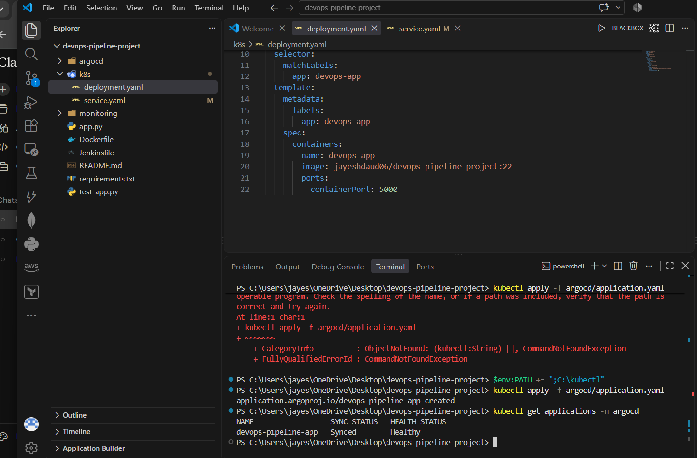
*Manifest source alongside the terminal history showing the ArgoCD apply.*

---

### 5. Jenkins CI pipeline (8 stages)

Triggered on `git push` via GitHub webhook. Installed on the Jenkins EC2: Jenkins, SonarQube (Docker container), Trivy, Docker, AWS CLI, kubectl, Python3/pip3, sonar-scanner CLI.

Pipeline stages: Checkout SCM → Checkout Code → Install Dependencies → Run Tests → SonarQube Analysis → Build Docker Image → Trivy Security Scan → Push to DockerHub → Update K8s Manifest (commits new image tag back to Git).

```bash
git add .
git commit -m "<message>"
git push   # triggers Jenkins automatically via webhook
```

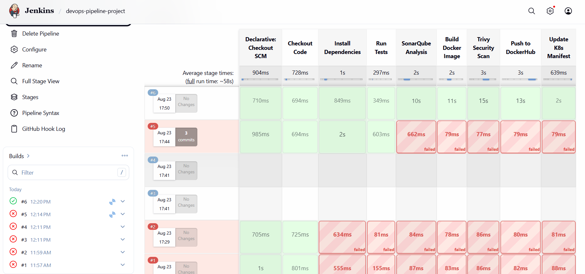
*Build #6 fully green across all 8 stages (~58s total). Builds #1–5 show real failures fixed along the way — credential ID mismatches, a Groovy quote syntax error, and an outdated `pip3 --break-system-packages` flag.*

---

### 6. Live application

App exposed via the LoadBalancer Service's AWS ELB, deployed fully through the automated pipeline (image tag confirmed live).

```bash
kubectl get svc devops-app-service -n default
# EXTERNAL-IP is the live ELB endpoint
```

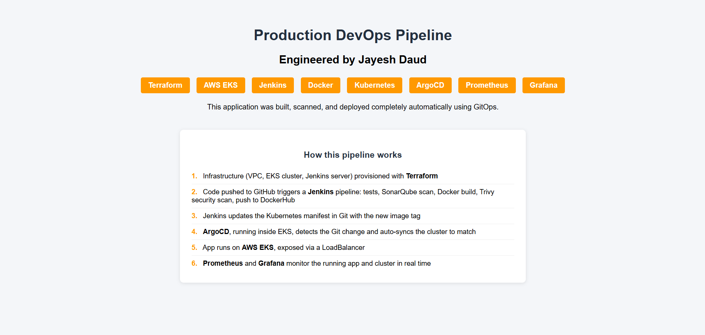
*App homepage with Terraform/EKS badges and a "How this pipeline works" explainer, shipped via the pipeline itself.*

---

### 7. Monitoring — Prometheus + Grafana

Installed via Helm (`kube-prometheus-stack` chart) into the `monitoring` namespace.

```bash
helm repo add prometheus-community https://prometheus-community.github.io/helm-charts
helm repo update
helm install monitoring prometheus-community/kube-prometheus-stack -n monitoring --create-namespace

kubectl port-forward svc/monitoring-grafana -n monitoring 3000:80
kubectl get secret monitoring-grafana -n monitoring -o jsonpath="{.data.admin-password}"
# base64 decode the output; username = admin
```

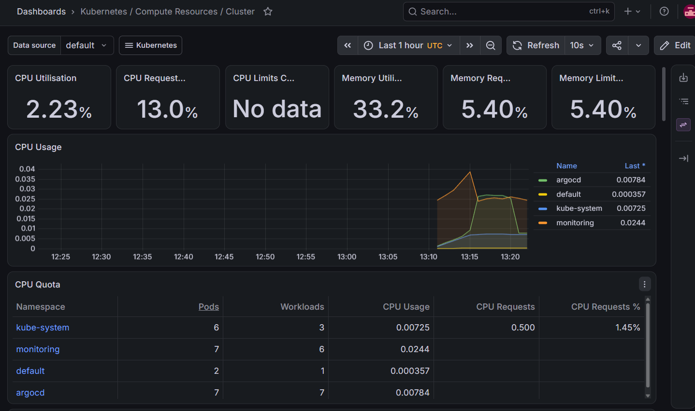
*Kubernetes / Compute Resources / Cluster dashboard — CPU/memory utilization broken down by namespace (kube-system, monitoring, argocd, default).*

---

### 8. Custom alert — DevOpsAppPodsDown

`monitoring/custom-alerts.yaml` — a `PrometheusRule` that fires if `devops-app` has fewer than 2 healthy pods for 1 minute sustained.

```bash
kubectl apply -f monitoring/custom-alerts.yaml
kubectl get prometheusrules -n monitoring
```

**Tested end-to-end via the correct GitOps flow** — not `kubectl scale` directly (which ArgoCD's `selfHeal` would have reverted), but by editing Git itself:

```bash
# 1. Edit k8s/deployment.yaml: replicas: 2 -> 1
git add k8s/deployment.yaml
git commit -m "test: scale to 1 replica to trigger PodsDown alert"
git push

# 2. Force ArgoCD sync (or wait ~3min for auto-poll)
kubectl get pods -n default -l app=devops-app -w

# 3. Wait ~90s, check Alertmanager/Prometheus for the alert firing
kubectl port-forward svc/monitoring-kube-prometheus-alertmanager -n monitoring 9093:9093
# open localhost:9093

# 4. Revert
# Edit k8s/deployment.yaml: replicas: 1 -> 2
git add k8s/deployment.yaml
git commit -m "revert: restore 2 replicas after alert test"
git push
```

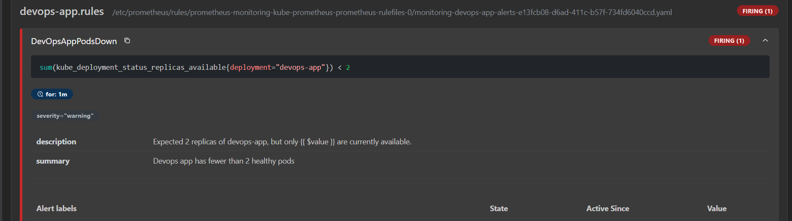
*DevOpsAppPodsDown — FIRING (1). Full rule expression, `for: 1m` window, severity label, and description all confirmed correct.*

---

### 9. ArgoCD — full reconciliation view

```bash
kubectl port-forward svc/argocd-server -n argocd 8081:443
# open https://localhost:8081
```

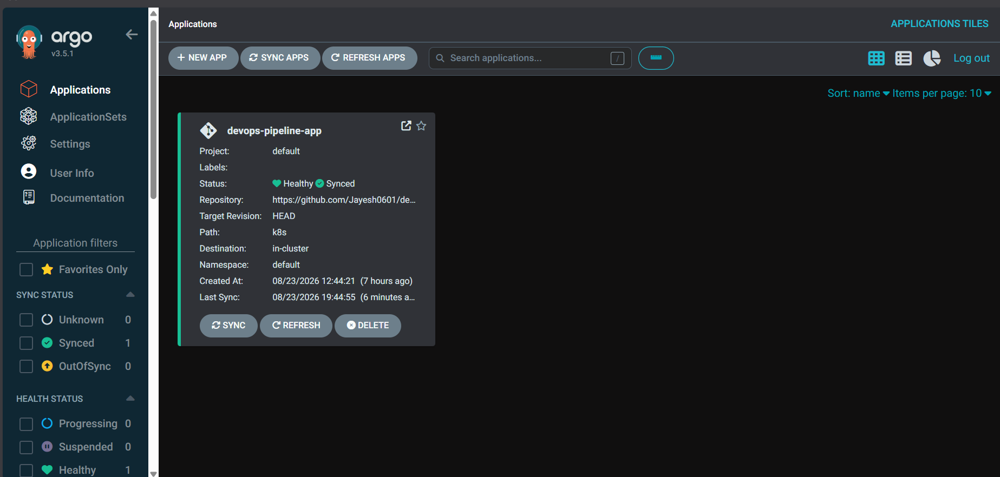
*Applications overview — Healthy, Synced.*

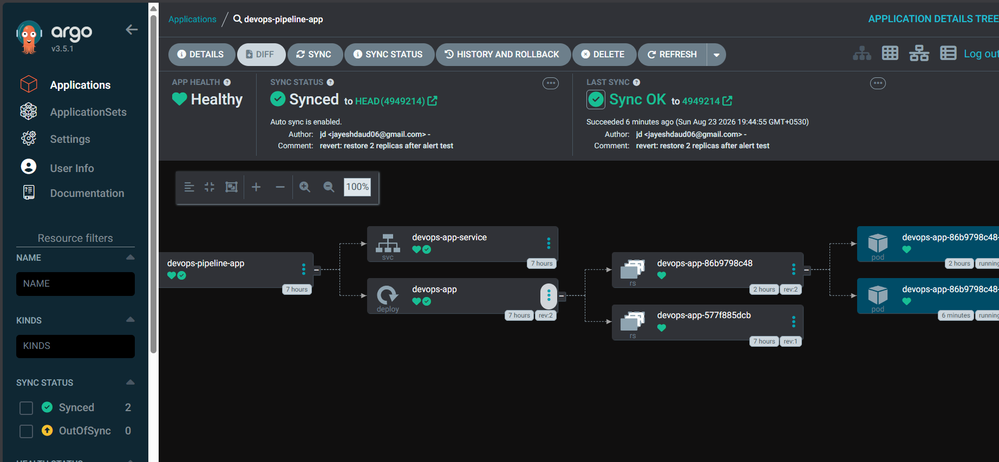
*Full reconciliation tree: Application → Service → Deployment → ReplicaSet → Pods, synced to the revert commit ("restore 2 replicas after alert test").*

---

## Known Tradeoffs (deliberate, for a demo/interview environment)

- **No NAT Gateway** — public subnets used directly to control cost; production setup would move worker nodes to private subnets behind a NAT Gateway
- **SSH security group open to 0.0.0.0/0** — home IP behind CGNAT made static whitelisting impractical; production alternative would be AWS Systems Manager Session Manager (no open SSH port) or a bastion host
- **No Alertmanager notification channel wired up** — alert fires and is visible in-UI, but isn't yet routed to Slack/email/PagerDuty
- **Local Terraform state** — production setup would use a remote backend (S3 + DynamoDB lock table) for team-safe state management

---

## Teardown

```bash
cd eks-devops-project
terraform destroy
```

---

## Author

**Jayesh Daud** — Cloud DevOps Engineer
[GitHub](https://github.com/Jayesh0601) | DockerHub: `jayeshdaud06`
